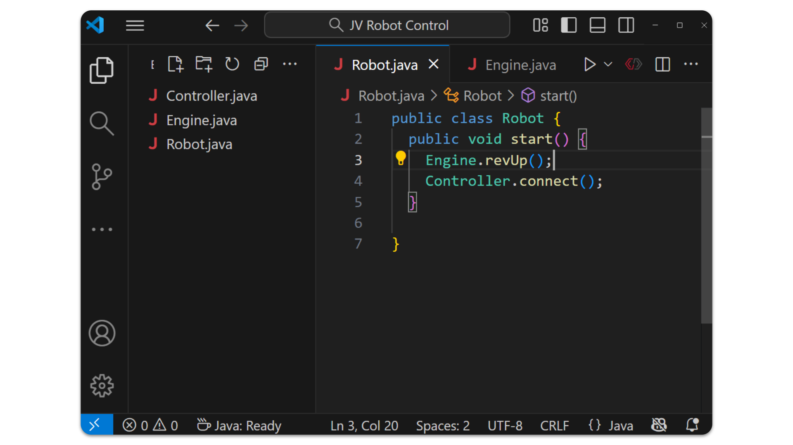
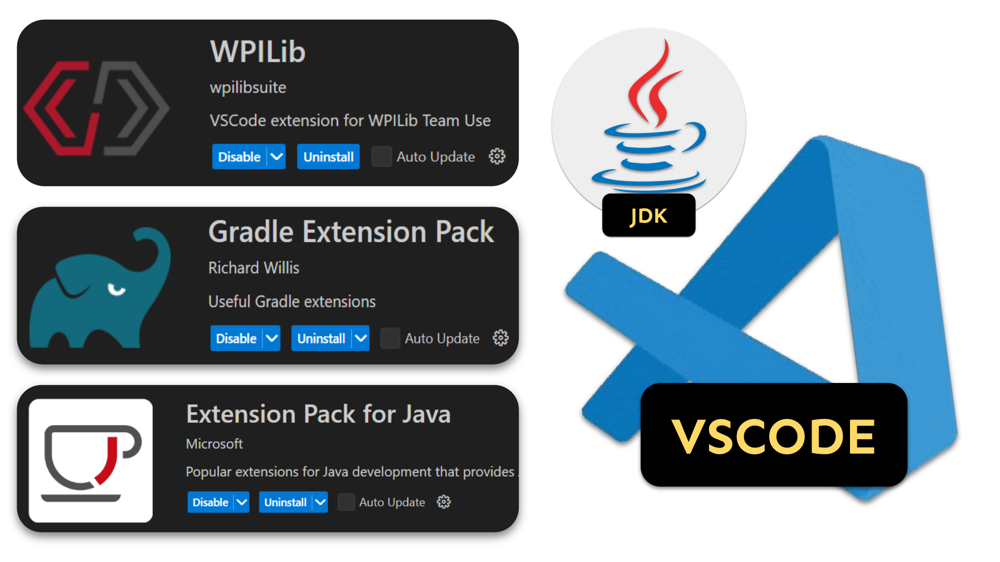
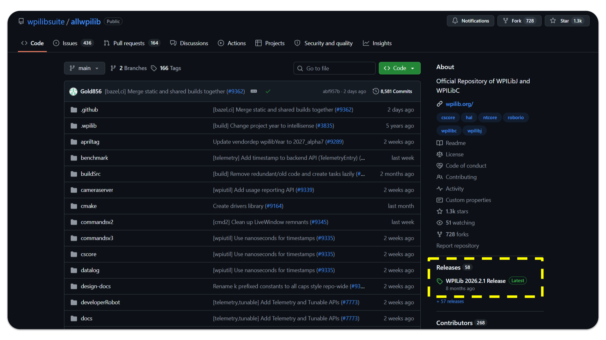
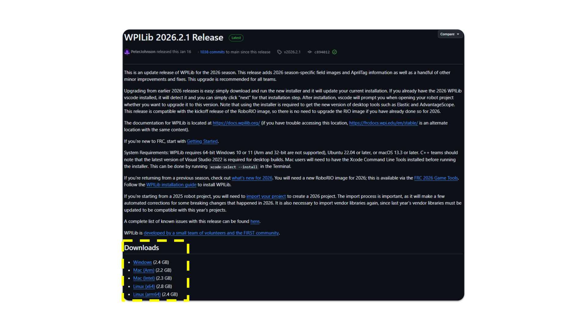
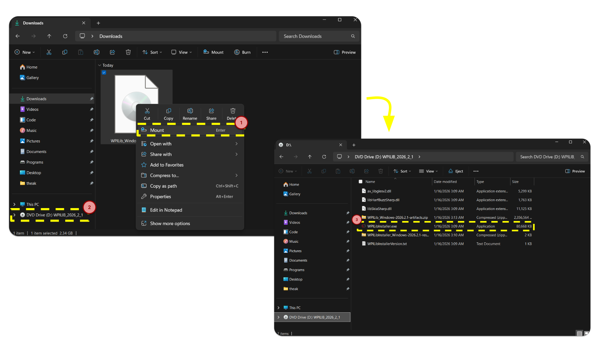
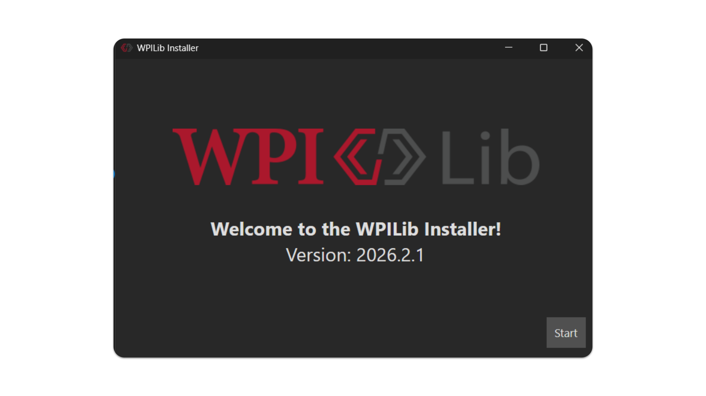
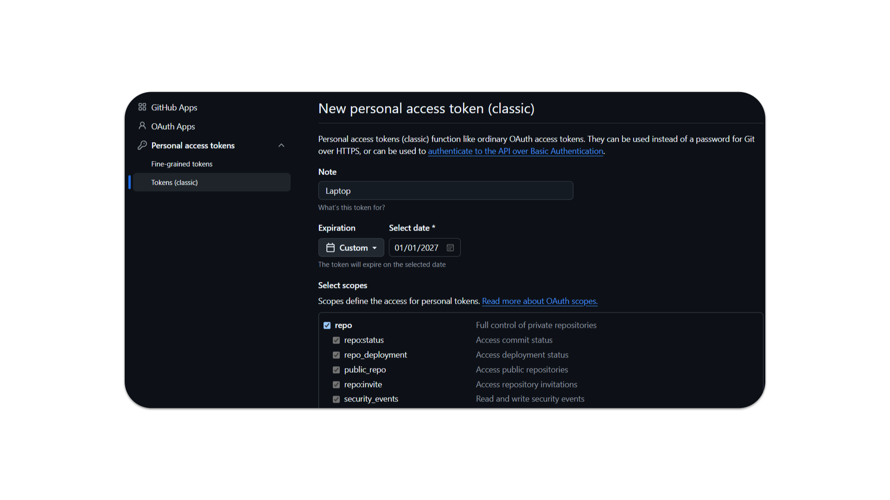

# Software Setup

**Hello, young aspiring programmer!** This guide will explain what software we use, why we use it, and how to get said software onto your computer.

1. **[Visual Studio Code](#visual-studio-code)**
2. **[Git and Github](#git-and-github)**
3. **[WPILIB](#wpilib)**

## Visual Studio Code



**Visual Studio Code** (VSCode) is a code editor developed by **Microsoft**. Not to be confused with **Visual Studio** (purple logo). While there are many different code editors to choose from, VSCode is unique for a few reasons.

1. **Beginner Friendly** - VSCode features a minimalist interface that does well to keep what's actually important in focus. Other code editors (such as **Visual Studio**) can be overwhelming for inexperienced users to navigate.
2. **Widely Used** - VSCode is incredibly popular, especially for writing Java programs. The main benefit to this is that any issues you might encounter will most likely have a pre-existing solution on the internet. In addition, a large user-base translates to a large amount of extensions that can ease the coding process.
3. **Officially Supported** - VSCode is the official code editor recommended for the *FIRST Robotics Competition*!

## Git and Github


Writing code with other people is complicated. Changes to one part of the codebase may completely break another part of the codebase. And if any part of the code has an error, **it won't even run** (i.e. if someone were to have an error in their part of the code, then you have to fix their mistake before being able to test your own code).

To help with collaboration, we keep a version of our code on on a website called **Github** (where everybody can access it). If somebody wants to edit the code, they have to:

1. Download the code from Github to their computer
2. Make changes to the code (using VSCode)
3. Upload the revised code back onto Github

**Git** is an app that allows us to upload and download our code to/from Github, In addition to giving us a whole bunch of nifty features (such as being able to revert to previous versions of the code). 

Every person has their own copy of VSCode and Git, but they share one **repository** on Github.

## WPILIB

**WPILIB** is a collection of apps and libraries made by students at *Worcester Polytechnic Institute* (a university) in collaboration with *FIRST Robotics* in order to simplify the process of programming a robot. Everything you need is contained within a single download shipped every year.



WPILIB includes an augmented copy of VSCode. This version of VSCode includes various extensions that are relevant to robotics, in addition to pre-configured settings that simplify the setup process. While the extensions and settings *can* be applied manually to any existing copy of VSCode, it is a hassle and is generally not advised.

Writing Java applications also requires a **Java Development Kit (JDK)**. Normally, for other purposes, people install the JDK manually. However, writing code for the *FIRST Robotics Competition* requires a *specific version* of the JDK that is only included in WPILIB.


In addition to VSCode, several other apps are included for various purposes. For example, **AdvantageScope** (top left of the image above) gives you a graphical interface for simulating certain robot actions.

Information about these apps will be introduced gradually in the coming lessons.

## Setting up WPILIB

***NOTE: IF YOU ARE USING A SCHOOL COMPUTER, WPILIB SHOULD ALREADY BE INSTALLED FOR YOU***

Head over to [the Github repository for WPILIB](https://github.com/wpilibsuite/allwpilib) and click on whatever release it shows you up front.



Next, scroll down to find the **"Downloads"** section. From here, pick your favorite operating system and **click the link** to install the ISO / DMG file. 



**MAC:** Open the *DMG* file you just downloaded and then run the installer. If you are unsure of which link to use, [follow this guide to find out what processor you have](https://www.howtogeek.com/706226/how-to-check-if-your-mac-is-using-an-intel-or-apple-silicon-processor/). If you have an **Apple/M-Series** processor, use the **ARM** download. If you have an **Intel** processor, use the **Intel** download.

**WINDOWS:** Mount the *ISO* file after it has been downloaded by right-clicking on it and selecting *Mount*. After that, open *File Explorer* and find the newly mounted folder (it will most likely be next to *This PC* in the sidebar). Once you have found this, run the installer.

**LINUX:** Good luck 🫡



The installer will provide you with several options for what exactly to install. It is recommended to pick *everything* for *this user only* (if this is not your own private computer) and *download VS Code for your computer only*.



## Setting up Git and Github

***NOTE: IF YOU ARE USING A SCHOOL COMPUTER, GIT SHOULD ALREADY BE INSTALLED FOR YOU***

Head over to [the official Github website](https://github.com) and *sign up* with any email you would like (aside from NYCStudents). You don't have to worry about the settings for now, just make sure to **remember your email and username**.

Next, head over to [the official Git website](https://git-scm.com/downloads) and download the **Git Installer**. Run the installer using the **default settings**.

Finally, we have to link Git with your Github account. **Open up the Command Line**. If you are unsure about how to do this, look it up! Run the 3 commands below to configure Git. Make sure to swap out *[Your Name]* with your Github username and *[Your Email]* with your Github-associated email address.

```shell
git config --global user.name "[Your Name]" 
git config --global user.email "[Your Email]"
git config --global core.editor "code --wait"
```

Next, we have to give Git permissions from your Github account.

1. Go to GitHub and **log in**
2. Click on your profile picture in the top-right corner and **select** *Settings*
3. **Scroll down** to *Developer Settings* in the **left sidebar**
4. **Click** on *Personal access tokens* (classic) and **then** *Generate new token*
5. **Name** your token and **set the expiration date**
6. **Select** the *repo* scope
6. **Click** "Generate token" at the bottom of the page
7. **Copy the generated token** immediately (you won't be able to see it again)



Open Terminal once again and run the following command:

```shell
git ls-remote https://github.com/fake-username/fake-repo-name.git
```

When prompted for your password, **enter your PAT instead**.

If you got a *Repository not found* error, **everything went right!** 

If you get an *Authentication failed* error, double-check your PAT and try again.

**On most modern systems**, Git will automatically store your credentials after you've entered them once. If, however, you find that you're being asked for your PAT repeatedly, you may need to **set up a credential helper**

How to setup a credential helper:

**For Mac:**

```shell
git config --global credential.helper store
```

**For Windows:**

```shell
git config --global credential.helper wincred
```

*Guide written by Ankit Kumar (Class of 2027)*