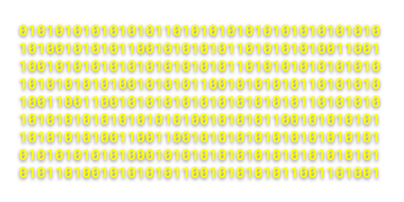
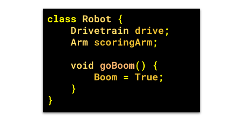
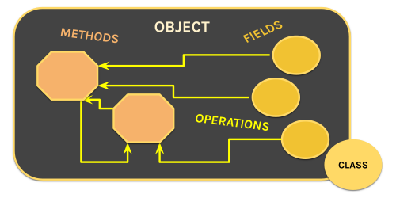
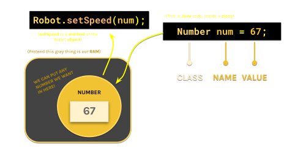
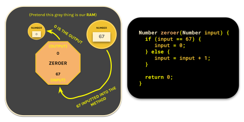
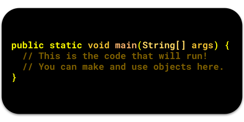
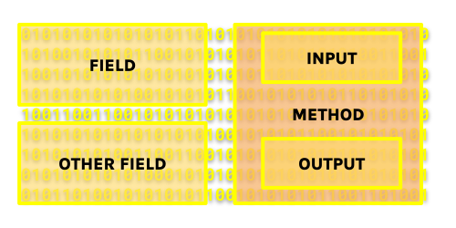

# Introduction to Java

**Hello young aspiring programmer!** This guide will serve as a conceptual introduction to **the Java programming language**.

Here is what will be covered here:

1. **[What is a program?](#what-is-a-program)**
2. **[What is computer memory?](#what-is-computer-memory)**
3. **[What is Java?](#what-is-java)**
4. **[How is Java code organized?](#how-is-java-code-organized)**
5. **[How do we store things?](#how-do-we-store-things)**
6. **[How do we do things with those stored values?](#how-do-we-do-things-with-those-stored-values)**
7. **[Grammar in Java (Syntax)](#grammar-in-java-syntax)**
8. **[Primitives and the Main Class](#primitives-and-the-main-class)**
9. **[Java Native Interface and Signaling](#java-native-interface-and-signaling)**

If you are curious on **what apps you're gonna need to get started**, head over to [our Software Setup Guide](SoftwareSetup.md).

## What is a program?

A **program** is **an ordered list of instructions** that are done **one-after-the-other** by the computer. We write **programs** with **code**. Code is **written** in text with a special form of **grammar** called **Syntax**.

Every program has to be **broken down** into actions that a **CPU** can execute. These actions have to be in **binary** (long list of 1's and 0's) and are predefined **by your CPU** using **specific codes** (ARM and x86 processors are made differently for this reason, **they have different sets of commands**).

> CPU Commands include things like **ADD** and **SUBTRACT**. These commands can be represented with **binary codes** such as 0110 or 0111 that the CPU can **read** and **understand**.

## What is computer memory?

**Memory** is essentially **a space** where our program can **store** and **get** data while doing things. It is a gargantuan array of 1's and 0's that all have locations assigned to them. Storing data is useful because you would most likely want to base your program's **decisions** on **calculations** that you have made previously.

Memory (Primary Storage) is **different** from your **Secondary Storage** (what you would call your *main storage* or *drive*) because it is **much** smaller and **much** faster.

>Another name for memory is **RAM**, and another name for secondary storage is **ROM**.

Our programs interact with memory **much more** than they interact with secondary storage (**because we don't store a lot of data when coding a robot**). Whenever we refer to **storing things** or **stored data** we are referring to storing **in memory**.

## What is Java?

**Java** is a **language** that we write code in. Java utilizes **English** words in a syntax that is very reliant on **Curly Braces { }** to define when certain **segments of code** start/stop, **Parentheses ( )** for operations and math, and **SemiColons;** to end specific **actions**. This lets Java code **ignore indentation** (and spacing for that matter) in order to **make writing/editing code easier**.

>Java also manages and interacts with the computer's **memory** for us (**instead of us having to do it ourselves**), allowing us to **store data** easily.

## How is Java code organized?

Java employs a very popular **code-organization** technique called **Object-Oriented-Programming**. In this type of programming we split our **actions** (like driving the robot) and **stored data** (like the joystick position from our Xbox Controllers) among **objects**. Objects can both **store data**, and **act on that stored data**.

>For example: we can have an **Arm** object that **controls the arm**

**Things we store** in objects are called **fields**. **Actions that we add to** objects are called **methods**. **Classes** define **how** a **chunk of memory** on your computer should be **reserved** to fit an object. You use classes to create **objects**.

## How do we store things?

**Fields** (places where you can store data) are easy to make. All you need to do is **define the class** that you will be using to reserve that *chunk of memory* for your field; and then **create a name** that you can use in your code to **reference** that *chunk of memory* (or object).

> **For Example:** I can have a field in my **Robot** object that stores a **Drivetrain** object.

## How do we do things with those stored values?

**Methods** (actions) are also easy to make. Methods are special in that you can run them **with parameters** (data that you give the method as you run it) and **get an output** (data that the method spits out).

> **For Example:** I can have a method that blows up the robot with an **input** of time (till the robot blows up) and an **output** of whether or not the explosion was successful.

All you need to do to make a method is...

1. **Create a name for your method** (like 'blowUpRobot' or 'startMatch')
2. **Define the class of the output** (in order to **reserve space** for that output)
3. **Define the class of the input** (you can't really do much with 10111100110)
4. **Create names for all of the inputs** (so that you can use them in the method itself).

Methods **do not** have to output anything nor do they have to have **inputs**.
>In these cases, you would switch out the output class with the **void** keyword.

Inside methods, you can do a couple of things:

1. You can create **temporary objects** called **variables**.
2. You can **run other methods** that are in your fields/variables.
3. You can use **logic** (such as if-then statements) to make decisions.
4. You can use the **return** keyword to end the method and **output** stuff.

When you are **calling** a method that **has an output**, you can treat your method exactly the same as **any other form of stored data** (fields or variables).

> **For example:** If I had a method called **twoPlusOne** which returns **3** (Yes, this is a completely pointless thing to do but bear with me); The statement **twoPlusOne() - 4** is a completely valid math expression (that will return -1).

This is also why you need to define the output's **class**, since you need to  **reserve a space in memory** for the output to exist. You do this by putting the **output class** before the **name**.

You need classes for inputs because your program can't really understand the jumble of 1's and 0's otherwise. When you **specify the class**, those 1's and 0's become actually readable **fields and methods**. You put your **inputs** (along with their types) **inside the parentheses**.

## Grammar in Java (Syntax)

Here are some rules for **Java Syntax**:

1. **// Double Slashes create Comments!** (these aren't part of the code)

2. End all of your **statements** with **Semicolons**;

3. {Wrap **classes, methods, and the insides of logic statements** in **CurlyBraces**}

4. (Wrap all method **inputs** and logic **inputs** in **parenthesis**)

5. **Do_Not_Include_Spaces_In_Your_Names** (Java can't handle it)

## Primitives and the Main Class

Java is all about **Object-Oriented-Programming**. However, **not everything is an object**. You cannot have *"object inside objects inside objects inside objects inside objects-"* go on forever! There must be a **start point** and a **stop point**.

When you run a Java program, the computer that is running it looks for one thing- **The Main method**. This method has a very unique structure that looks like this:

Once the program finds this method, it will start here and go down the list **one-by-one** and run everything. The class that contains the main method is called **the Main Class**. This is the **start point**.

Fundamentally, Objects are just **a bunch of 1's and 0's**. Classes are made to tell you **which parts of that bunch mean what** (they assign names to specific clumps of 1's and 0's). *If you keep breaking things down into their parts, you will reach a point where **you can't break things down anymore**.*

There will be a certain amount of times you can slice up those 1's and 0's before you find things that you **can't really break down further**. Physics draws this line at the **individual 1's and 0's** (You can't have some transistor be *half-on*). However, Java is a **programming language** that is meant to be **actually readable**. Because the entire point of having a programming language is so you **don't** have to interact with 1's and 0's, Java decides to draw this line at **numbers, letters, and booleans**.

These values are called **primitives**. Primitives are the only types of data that **are not** considered objects. They **do not** have parts to them and **cannot** be broken down further unless you are a **crazy psychopath** that likes to use C++. This is the **stop point**.

>Without a class, this would all just be a jumble of 1's and 0's!

## Java Native Interface and Signaling

So, we have our objects, our main method, our classes, our numbers and letters; **how do these things work to control a physical robot**? Well, Java doesn't really have a way of interacting with the **motors** and **other electronics** directly. Instead, Java uses **C++** to do it for us.

>C++ has the power to send raw data through wires!

In order to interact with C++, Java uses these **Java Native Interfaces** or **JNI**'s which essentially **holds C++ code** in a way that **can be used in your Java program**. These JNI's are almost all hidden from you while coding the robot (**WPILIB® manages them for us**). When the time comes to apply voltage to a motor or change the color of an LED, We run the code in the **.jni** file (with some **special methods**) and the computer sends a stream of 1's and 0's down the wires into the electronics devices.

>We will revisit this much much later on! Don't worry too much about JNI's for now as a lot of it will be hidden from you.

>That is all! Farewell young aspiring programmer! Head over to **[our Intro to Java 2](IntroToJava2.md)** to continue your journey.
