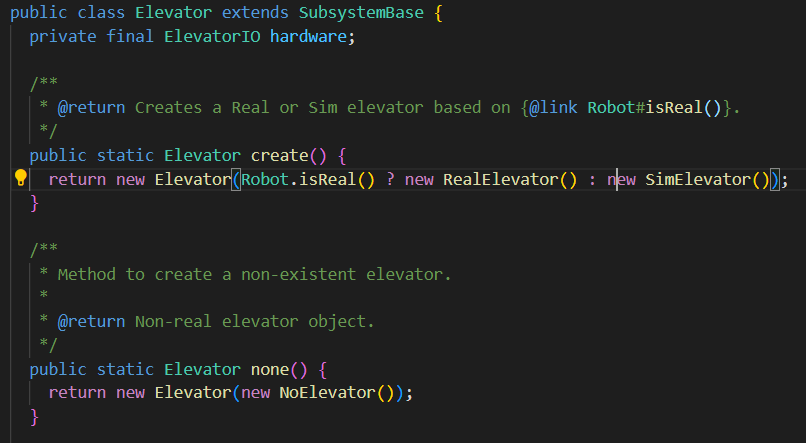

# Basic Elevator Tutorial

In this tutorial, you'll be writing code to control an elevator in this tutorial. It will be able to command the elevator to any position in its range of motion

## What is an elevator?

 

An elevator moves linearly up and down with its various "stages." It used to help us reach different points above us in a game, and you will usually mount your scoring mechanism on the central rectangular stage (always at the top in this image, but it will move down to the bottom when the elevator is fully down). While there's further complexity with how its rigged and what that means for control, we'll go into that later.

## Prerequisites

You should have completed [Differential Drive](./DifferentialDrive.md), a lot of core concepts taught there are necessary here. You should also be able to use interfaces, some inheritance, and use [commands](../reference-sheets/CommandBased.md) in your code.

Additionally, it's recommended that you complete an [Arm bot](TBA) before working on this. While you can go through this project without it, if you don't have a reason to do otherwise Arm subsystems are ever so slightly less complicated than elevators. There's a lot of small changes and some big ones, so even if you have completed Arm I recommend still working through this, but ideally noting where things are the same and possibly trying to write more on your own.

## Setup
Create a new branch for this subsystem and move into it. Check out the [Git Guide](../reference-sheets/GitGuide.md) if you need help with that.

In your robot project, create a new folder called ```elevator``` and in it, files called ```Elevator.java```, ```ElevatorConstants.java```, ```ElevatorIO.java```, ```NoElevator.java```, ```RealElevator.java```, ```SimElevator.java```. We'll write stuff for them in a bit.

## Hardware Abstraction
As with most complex subsystems, we use hardware abstraction to help us write modular code, meaning we can swap out simulated or real hardware, or even just quickly turn off a subsystem when we don't have it on the test robot. If you want to look more into this paradigm, read the [Hardware Abstraction](TBA) guide.

The first step to hardware abstraction is to create the IO interface that sets a guide for the classes. For the elevator, it typically is written like this:

```java
public interface ElevatorIO extends AutoCloseable {
  public void setVoltage(double voltage);

  public double position();

  public double velocity();
}
```

Remember that these are the unimplemented methods that we will later implement in NoElevator, RealElevator, and SimElevator. setVoltage() is how we control the subsystem, and position() as well as velocity() give us information about it, whether it be real or simulated. 

### NoElevator
The first implementation, NoElevator, is always really simple. We mostly use it when we have other subsystems on our robot, but the elevator isn't on it or working yet. It provides us a quick and easy way to turn off the subystem without changing code we'd have to remember to change back. For this and almost every other NoSubsystem, you do the least possible. 

So for setVoltage, you'll make it an empty method, and for position and velocity, you'll return 0. In some cases, depending how you structure your code, it might make more sense for you to make the position it returns the starting position of the elevator, but for this we'll be using 0 for that anyway (indicating extension rather than position).

### RealElevator
RealElevator is actually work this time, and it consists of motors, encoders, configurations for both, and implementations of the method headers.

#### Motors and Configs
For this project, we'll use [TalonFX-based motors](https://v6.docs.ctr-electronics.com/en/stable/docs/hardware-reference/talonfx/index.html). These have built in relative encoders, which we can use for this since the elevator will always be initiliazed at its starting state at the bottom (remember that absolute encoders are used for extra precision or when the subsystem won't always return to the same spot before turning off). Because they're built in to the motor, the ```TalonFX``` class will handle the encoder for us. Because of this, we just initialize two motors:

```java
  private final TalonFX leader = new TalonFX(FRONT_LEADER);
  private final TalonFX follower = new TalonFX(BACK_FOLLOWER);
```

Remember to create an ```Elevator``` class in ```Ports.java``` and initialize FRONT_LEADER and BACK_LEADER. Then, you can import them statically (so they can be used as if they were declared in the same file) like this:
``` import static org.sciborgs1155.robot.Ports.Elevator.*; ```

Next, in the constructor, we'll configure the motors. To do this, we use the ```TalonFXConfiguration``` class:
``` TalonFXConfiguration talonConfig = new TalonFXConfiguration();```

There are three configurations we'll do, though in different circumstances you may need more. We first set the motor to brake mode, meaning when at zero voltage it will try to hold its position, rather than free spinning (very bad for an elevator). We really only use the other, coast mode, for flywheels. 
``` talonConfig.MotorOutput.NeutralMode = NeutralModeValue.Brake;```

Next, we set the current limit on the motor. This prevents us from frying our motor or having it behave very badly.
``` talonConfig.CurrentLimits.SupplyCurrentLimit = CURRENT_LIMIT.in(Amps);```
We also now have to use our ```ElevatorConstants``` file. In it, create CURRENT_LIMIT using the [Units library](https://docs.wpilib.org/en/stable/docs/software/basic-programming/java-units.html):
``` public static final Current CURRENT_LIMIT = Amps.of(65);```
Import it statically like we did with our Ports!

Finally, we set the conversion factor: ``` talonConfig.Feedback.SensorToMechanismRatio = CONVERSION_FACTOR;```. Again, make it in the ```ElevatorConstants``` file, but for now make it around 50-60. It describes the gear ratio of our elevator, and tells us how high the elevator goes for each spin of the motor. Since you don't have a real elevator, we'll use a reasonable number of a 1:60 reduction.

Before we apply everything, make the follower motor do whatever the leader does:
```java
follower.setControl(new Follower(FRONT_LEADER, true));
```
The true here means that the follower should spin opposite the leader motor. Here's a simplified representation of an elevator gearbox where that would be what you do:


Finally, we apply the configs and register the motors:
```java
leader.getConfigurator().apply(talonConfig);
follower.getConfigurator().apply(talonConfig);

leader.setPosition(0);
follower.setPosition(0);

TalonUtils.addMotor(leader);
TalonUtils.addMotor(follower);
register(leader);
register(follower);
```

#### Method implementations
Now that you've done the configs, you're actually pretty much done! Here's your methods:
```java
@Override
public void setVoltage(double voltage) {
    leader.setVoltage(voltage);
}
@Override
public double position() {
    return leader.getPosition().getValueAsDouble();
}
@Override
public double velocity() {
    return leader.getVelocity().getValueAsDouble();
}
```
Pretty simple! We have the follower do whatever the leader does, so we only use the leader in these implementations. And since we already have the conversion factor set, we just get the default position and velocity and it converts the turns of the motor to elevator height for us. Remember to use the right units for everything, though.

### SimElevator
SimElevator will let you test your logic even when you don't have a real robot.

#### Sim configuration
This is the bulk of creating your simulation class. We use the [WPILib classes](https://docs.wpilib.org/en/stable/docs/software/wpilib-tools/robot-simulation/physics-sim.html) to help us with this.

Quite literally every configuration is done in the constructor of our simulation class, ```ElevatorSim```:
```java
private final ElevatorSim sim =
    new ElevatorSim(
        LinearSystemId.createElevatorSystem(
            DCMotor.getKrakenX60(2), WEIGHT.in(Kilograms), SPROCKET_RADIUS.in(Meters), GEARING),
        DCMotor.getKrakenX60(2),
        MIN_EXTENSION.in(Meters),
        MAX_EXTENSION.in(Meters),
        true,
        MIN_EXTENSION.in(Meters));
```

Remember, you do not have to remember everything. Whenever you're creating these simulation classes, we highly recommend you write out ```... new ElevatorSim```, and look at what you need to give them. Use the classes you're supposed to use, and you can always look back at this or other projects you've worked on to remember how you're supposed to do it. The important thing is that you get it written in the end, not that you remember everything.

For now, here's the constants you'll need:
```java
  public static final Distance MIN_EXTENSION = Meters.of(0.0);
  public static final Distance MAX_EXTENSION = Meters.of(1.455);
  public static final Mass WEIGHT = Pounds.of(6.142);
  public static final Distance SPROCKET_RADIUS = Inches.of(1.7565 / 2);
  public static final Distance SPROCKET_CIRCUMFRENCE = SPROCKET_RADIUS.times(2 * Math.PI);
  public static final double GEARING = 9.375;
  public static final double CONVERSION_FACTOR = GEARING / SPROCKET_CIRCUMFRENCE.in(Meters) / 2;
```
(there's CONVERSION_FACTOR here)

Whatever you do, just thing about what you're writing - notice how we get two KrakenX60s, which isn't always going to be true. Maybe there'll be three, or it's a different kind of motor. For now though, this isn't really the most interesting, and we move on.

#### Methods
Though a little more interesting than ```RealElevator```, you're mostly done by this point as well. Position and velocity are much the same:
```java
@Override
public double position() {
    return elevator.getPositionMeters();    
}
@Override
public double velocity() {
    return elevator.getVelocityMetersPerSecond();
}
```

setVoltage is slightly different
```java
public void setVoltage(double voltage) {
    elevator.setInputVoltage(voltage);
    elevator.update(Constants.PERIOD.in(Seconds));
}
```
The simulation simply needs how long it's been, which real-world motors would typically know (which is why we need the extra update line).

## The Big Subsystem
You've finished all the IO files! Now, you bring them together in your ```Elevator.java``` file to control the whole subsystem. First, there's some boilerplate that every main subsystem file it has. 

### Boilerplate code


The hardware field stores our ElevatorIO implementation, and the class itself will never know which one it is. It simply interacts through the interface methods, once again making it very swappable. The create method uses [ternary operators](https://www.w3schools.com/java/java_conditions_shorthand.asp) to use RealElevator if the Robot is physical, and simulate it otherwise. None is just used when we don't want anything happening with that subsystem on the real robot (like when testing other mechanisms), so we none it instead of creating it normally.

### Controlling your mechanism; Feedforward and PID with Trapezoid Profile

Smooth pathing and control are the main responsibilities of most complex subsystem files, and if you need review, please go through the [guide](../reference-sheets/ControlTheory.md). We use a specially modified type of PID controller that uses a [Trapezoid Profile](https://docs.wpilib.org/en/stable/docs/software/advanced-controls/controllers/trapezoidal-profiles.html). This more accurately commands the subsystem within its limits, keeping it too a max velocity and acceleration. 

We also use [wpilib feedforward classes](https://docs.wpilib.org/en/stable/docs/software/advanced-controls/controllers/feedforward.html), in this case ```ElevatorFeedForward```. The biggest change is that this feedforward applies a constant voltage to counteract gravity. 

#### Many, many constants

The first thing you'll need is a lot of constants:
```java
// For the Trapezoid Profile
  public static final LinearVelocity MAX_VELOCITY = MetersPerSecond.of(2);
  public static final LinearAcceleration MAX_ACCEL = MetersPerSecondPerSecond.of(2.8);

// For the FeedForward
  public static final double kS = 0.0755;
  public static final double kG = 0.2645;
  public static final double kV = 3.7;
  public static final double kA = 0.012;

// For PID
  public static final double kP = 3;
  public static final double kI = 0.0;
  public static final double kD = 0.0;
```

Understanding these constants is the meat of control theory, and though they aren't necessary to write the code for an elevator, they can be super crucial to learn when you actually have one. For now, let's get our classes set up.

```java
  private final ProfiledPIDController pid =
      new ProfiledPIDController(
          kP,
          kI,
          kD,
          new TrapezoidProfile.Constraints(
              MAX_VELOCITY.in(MetersPerSecond), MAX_ACCEL.in(MetersPerSecondPerSecond)));

  private final ElevatorFeedforward ff = new ElevatorFeedforward(kS, kG, kV, kA);
```

The important thing here is not to put the wrong constant in the wrong order. Also notice that we use a Profiled PIDController, which stores its own TrapezoidProfile in it by composition. This is simply for convienence so that we don't have to make yet another class, and doesn't change the logic at all.

#### The Update method

Complex mechanisms which require PID and smooth control usually have an update method. This handles all control theory in it, accepting a position that the mechanism is commanded to and setting the appropriate voltage. Additionally, this method is private; if you aren't using [commands](https://docs.wpilib.org/en/stable/docs/software/commandbased/commands.html), then it has to be private since outside sources *must* use commands to control a mechanism.

```java
  private void update(double position) {
    double goal =
        Double.isNaN(position)
            ? MIN_EXTENSION.in(Meters)
            : MathUtil.clamp(position, MIN_EXTENSION.in(Meters), MAX_EXTENSION.in(Meters));
  }
```
You can see we also make sure it's a valid goal position, because we don't wanna tell our elevator to go higher than it can (that would end in disaster). 

```java
double lastVelocity = pid.getSetpoint().velocity;
double feedback = pid.calculate(hardware.position(), goal);
double feedforward = ff.calculateWithVelocities(lastVelocity, pid.getSetpoint().velocity);
```

This is all calculations for pid and feedforward. Notice that the setpoints for feedforward are taken from the pid (which has the TrapezoidProfile in it). Only the pid gets the actual goal position. This will be pretty similar accross subsystems, with slight differences in the feedforward class requirements. Make sure to hover over the requirements when writing subsystems. After that, just set the hardware voltage to feedforward + feedback.

```java
    private void update(double position) {
    double goal =
        Double.isNaN(position)
            ? MIN_EXTENSION.in(Meters)
            : MathUtil.clamp(position, MIN_EXTENSION.in(Meters), MAX_EXTENSION.in(Meters));
    double lastVelocity = pid.getSetpoint().velocity;
    double feedback = pid.calculate(hardware.position(), goal);
    double feedforward = ff.calculateWithVelocities(lastVelocity, pid.getSetpoint().velocity);

    hardware.setVoltage(feedforward + feedback);
  }
```

One last thing! We need to make command factories to actually use this update method and control the subsystem. It's usually as simple as this main method:

```java
  public Command goTo(DoubleSupplier height) {
    return run(() -> update(height.getAsDouble())).finallyDo(() -> hardware.setVoltage(0));
  }
```

and specific usages:

```java
  public Command retract() {
    return goTo(MIN_EXTENSION.in(Meters)).withName("retracting");
  }
```

Notice how the update method let us make these lambda expressions nice and simple, and one line the whole command. With this, you've now made a controllable elevator that can go to any position! Check out the [file structure](../reference-sheets/FileStructure.md) to make sure everything looks right.