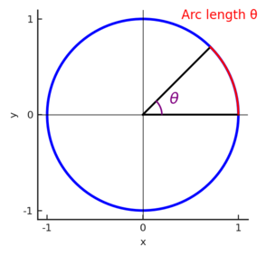

# Introduction

This is a basic overview of simple trig that you might need to use for robotics.
## Prerequisites
- [Algebra 1](https://www.khanacademy.org/math/algebra) - understanding of functions, cartesian coordinate grid
- [Basic geometry](https://www.khanacademy.org/math/geometry) - basics of angles, right triangles, and circles
# Radians

You are probably most familiar with angles being measured in degrees, where a right angle is 90°, and a full circle is 360°. However, the unit of degrees is somewhat arbitrary. Why should a degree be 1/360 of a circle, and not 1/180, or 1/2?

There's another common unit for angles that are less arbitrary, called *radians*.

360° is 2$\pi$ radians. For a unit circle (a circle of radius 1 centered at the origin), 2$\pi$ is also the circumference of a circle (circumference = 2$\pi$r). And in fact, for any sector of a unit circle with an angle of $\theta$ radians, the circumference is also $\theta$!



And if $theta$ is 1 radian, then that length is 1 unit.

We can generalize this to non-unit circles, and say that a radian is the angle created when the radius of a circle is wrapped around the circumference.


We sometimes use rad as an abbreviation for radians, and sometimes use no unit symbol at all.
## Converting Degrees to Radians

With the equation 360° = 2π rad, you can convert between degrees and radians:
$1° = \frac{π}{180}\hspace{0.1cm} rad$, or $1 \hspace{0.1cm}rad = \frac{180}{π}°$

There also exists a conversion method in Java, so you don't have to type out all the calculations:
```java
Math.toDegrees(angle); // angle is in radians, and the output is degrees
Math.toRadians(angle); // angle is in degrees, and the output is radians
```

# Angles in Right Triangles

We know that a right triangle is defined by a triangle containing a right angle (90° or $\pi$/2 rad). If you know one of the other angles of the triangle, then you know all 3 angles (ex. if you know that a right triangle contains a 50° angle, you know the missing angle is 40°, since the interior angles of all triangles sum to 180°).

Another property of right triangles is the ability to find the ratio of a leg over the hypotenuse as long as you know one of the angles (that's not the right angle). [This](https://services.math.duke.edu/~rann/labs106.2018pdfs/Lab1.A.Crash.Course.in.Trig.pdf) helps explain why this is the case.

So as long as you know an angle of the right triangle, and a side length, you can find the lengths of each side, and the angles of each vertex.

The trigonometric functions take the angle as the input, and output specific ratios ($θ$ represents an angle):


- $\sin(\theta) = \frac{Opposite}{Hypotenuse}$ - written as sine
- $\cos(\theta) = \frac{Adjacent}{Hypotenuse}$ - written as cosine
- $\tan(\theta) = \frac{Opposit}{Adjacent}$ also equal to $\frac{\sin(\theta)}{\cos(\theta)}$ - written as tangent

A popular mnemonic to memorize these functions is SOH-CAH-TOA, since:
- **S**ine = **O**pposite/**H**ypotenuse
- **C**osine = **A**djacent/**H**ypotenuse
- **T**angent = **O**pposite/**A**djacent

If you rearrange these slightly, you get that:
- $\sin(\theta)$ $\times$ Hypotenuse = Opposite
- $\cos(\theta)$ $\times$ Hypotenuse = Adjacent

Those are examples of equations you can use to find side lengths of a right triangle once you have one side and an angle (these particular formulas will also come back later).
## Angles in Unit Circle

So, the truth is, the definitions we just gave you for $\sin$, $\cos$ and $\tan$. What if our angle isn't acute? Then it's never part of a right triangle, so we can't just use SOH CAH TOA.

To find the complete definition of these trig functions, let's look at a unit circle again. 


In the image above, there is a triangle inscribed in the first quadrant of the unit circle, with an  angle $t$ at the vertex at the origin. The angle adjacent to $t$ is $x$, and the opposite angle is $y$. It's a unit circle, so the hypotenuse is 1.

We can use that information to calculate the trig functions for t:
$\cos(t)$ = $x$
$\sin(t)$ = $y$

You can also see this labeled on the diagram. And it turns out, this is the full definition of the trig functions.

The coordinates of any point on the unit circle are ($\cos(\theta)$, $\sin(\theta)$ ), where $\theta$ is the angle from the positive x axis to the point. And $\tan(\theta)$ is still $\sin(\theta)$ / $\cos(\theta)$.


This definition works for obtuse angles as well as acute angles. Let's look at a point in the second quadrant:


The coordinates of this point B are still ($\cos(\theta)$, $\sin(\theta)$ ). As you can see, the x value is negative, so cosine of an angle in the second quadrant must be negative. The y value is still positive though, so sine of an angle in the second quadrant is positive.

You can do similar evaluations in the other quadrants. Ultimately, you'll find that:
- cosine is positive in I and IV
- sine is positive in I and II
- tangent is positive in I and III

If thinking in terms of right triangles was helpful to you, you can imagine dropping a line from B to the x axis to create a triangle, and consider the x length (adjacent) to be negative in quadrants II and III, and the y lengths to be negative in quadrants III and IV, even though we generally consider all lengths to be positive. 

To wrap up, we'll turn to the values of trig functions for the angles 0, $\pi$/2, $\pi$, and $3 \pi$/2 (or 0°, 90°, 180°, 270°).

Let's look back to our unit circle:


As you can see, at 0 the coordinates are (1, 0), so we know that:
$\cos(0)$ = $1$
$\sin(0)$ = $0$
$\tan(0)$ = $0$ / $1$ = $0$

At $\pi$/2, the coordinates are (0, 1):
$\cos(\pi / 2)$ = $0$
$\sin(\pi / 2)$ = $1$
$\tan(\pi / 2)$ = $1$ / $0$ = undefined

So $\tan$ actually doesn't exist at $\pi/2$! This is also true for $3\pi / 2$

I'll let you figure out the rest of the trig functions for the $\pi$ and $3\pi / 2$.

## Code Representation

In Java, the `Math` library has methods for these trig functions:

```java
Math.cos(angle);
Math.sin(angle);
Math.tan(angle);
```

Keep in mind that these functions take in **radians**.
# Inverse Trig Functions

There are also the inverse trig functions, where if you input the ratio of the leg opposite of an unknown angle $θ$ over the hypotenuse of the triangle, the output is the angle:

- $\sin^{-1}(\sin(\theta)) = \theta$ - written out as arcsine
- $\cos^{-1}(\cos(\theta))$ - written out as arccosine
- $\tan^{-1}(\tan(\theta))$ - written out as arctangent

And, inversely:

- $sin(sin^{-1}(\theta)) = \theta$
- etc

In Java, the inverse functions are written like this:
```java
Math.asin(ratio);
Math.acos(ratio);
Math.atan(ratio);
```

But keep in mind that these are not perfect inverses. The trig functions are *periodic*. Which is to say, they repeat over and over again. We've so far only used angles between 0 and 2$\pi$, but we didn't have to do that. We could have found $\cos(3\pi)$, for instance. If you picture $3\pi$ on the unit circle, it's in the same place as $\pi$. So $\cos(3\pi)$ = $\cos(\pi)$ = $-1$. And this is true for an infinite number of different angles.

So you can't actually find just one angle that will give you a particular cosine value. If you tried $\arccos(-1)$, for instance, that could be $-\pi$ or $\pi$ or $3\pi$ etc. To clear up this ambiguity, the ranges of the inverse trig functions are limited to just one period:

- $sin^{-1}(\theta)$ returns values from $-\frac{\pi}{2}$ to $\frac{\pi}{2}$
- $cos^{-1}(\theta)$ returns values from $0$ to $\pi$
- $tan^{-1}(\theta)$ returns values from $-\frac{\pi}{2}$ to $\frac{\pi}{2}$
