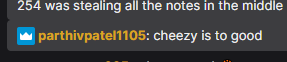
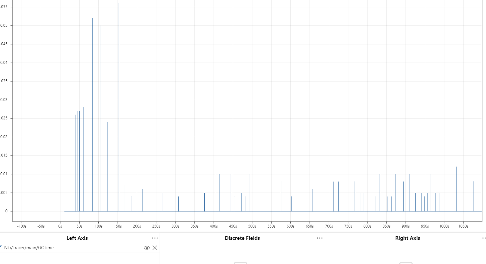

# Notes from 2025

2025 was cool. But it would've been cooler if we went to Worlds (reminder, as of this season, our last time was 2019.)

So here's a few things that went wrong on our (programming's) end.

## The Off-season

We planned to get proper vision and path following. We did not invest the proper time into it. Autos decided the game this year (and usually does each year).

We did not have proper vision or path following by the end of it :(

## Outdated/No Longer Supported Libraries

In the middle of our season, we wanted to update PhotonVision to experiment with the newest pose estimation algorithm aimed at localization from singular tags. We could not. Instead, we faced [this](https://github.com/PhotonVision/photonvision/blob/923f9564dc6d1f47c02fd7e1c2bab6ab150e91b1/photon-lib/src/main/java/org/photonvision/PhotonCamera.java#L184) on build :

###### mb gang couldn't recreate it without a robot lolol

After too much time spent digging, we found that [Monologue](https://github.com/shueja/Monologue), which went EOL 2024, was holding back the OpenCV update. This wasn't great. Staying with the current Monologue would prevent us from updating to any future versions of PhotonVision.

Thus, in the middle of the season, we moved away from Monologue to update to [Epilogue](). It worked out, but it was a decent amount of change, especially for the time.

Consider each of the libraries you're using before the season begins, and find possible alternatives.

Please also note that it is not apparent that libraries with older dependencies hold back those dependencies from updating.

## Time Management

We are not the Cheesy Poofs, INT Robotics, StuyPulse, The RoboTigers, or HighTide. We have a mere fraction of their time to work.

In 2025, we attempted all of the things below:

- on-the-fly pathing (with PathPlanner, then Repulsor)
  - during teleop, and with autos too
- acceleration limiting
- a scoring tablet, fleshed out with gui and automation
- 250hz wheel odometry
- full-field multi-tag localization

We put little consideration into time and resource limitations.

While we had the talent and the brains to work on all of these things, and had code written and logic'd out quickly, we fell short on time. *Testing* time.

We reeeallly tried to balance all of these things at once. New commands, new methods, new ways of thinking, a lot of which went wrong. We would struggle for an hour or so, and then move down the list, leaving a member incomplete.

Repeat, repeat, and repeat for 3 months. We unknowingly fell into this trap, getting nothing done **well**, and running with half-working functionality that worked just half the time. It truly showed in our performance.

Common FRC wisdom says that in robot design, you should pick one element of the game, and get really good at it.

With our time constraints (which I suspect will not get better), it would do us good to follow a similar message: one piece of fully tested, influential functionality, will do better than many lesser-tested ones.

In the end:

| Functionality | Status | Conclusion |
| -------- | -------- | ------- |
| OTF Pathing  |✅ Worked | Bad localization + overruns = inconsistent
| Acceleration Limiting | ❌ Half-worked     | Worked fine but units were always incorrect
| Scoring Tablet    | ❌ Half-worked | Got little testing time, never really got it working (sorry henry)
| 250hz Wheel Odo    | ✅ Worked | Don't know if it was influential   |
| Localization    | ❌ Half-worked | It sucked, see vision discussion below

This culminated in barely scoring, and having minimal impact on the game. :(((((((((

## Loop Overruns

### Deferred Commands (my opp)

Use deferred commands **sparingly**, especially when considering larger, beefier commands.

One reason why commands are so efficient is that they are effectively pre-loaded when built and deployed. This makes them very quick to schedule.

Deferred commands do away with this benefit; instead, commands will be (re)loaded and scheduled with the arguments given each time *it is called*, spiking runtimes for that loop.

### Garbage Collection

Java sucks. Observe the attached picture:

See those periodic spikes? They represent for how long each time the garbage collector ran. Numerous times, you may observe they went up to 0.05, over double the usual loop time of 0.02.

This can hurt. Drive and operator controls would delay some times. It hurt our elevator a bit. And it only gets worse if you have too many objects and deferred commands.

### VisualVM

So how can you identify these problems?

See the WPILib docs. They are accurate. They work (unless they don't). Yes, VisualVM is on DriverStation already (unless it isn't anymore.)

### Other minor optimizations

- Mutablity (dangerous!)
  - Keep track of the loop lest any unexpected behavior occurs. Saves new memory allocations though!
- Knowing the difference between method calls that ping immediate retrieval from a sensor vs a cached value
  - Polling new values from a sensor at 1000hz will Hurt.. . but if it retreives at 50hz and you call at 1000hz then little effect on timings!
- Loop timing
  - i forgot

###### Note: the new 2027 control system will have much faster specs, and thus, loop timings. This, hopefully, should be less of an issue then.

## Cameras

Please, for the love of all things great, consider these things for the annual game.

### Full-field Vision

This is not required for EVERY game. Especially this one. Sometimes, it can even hurt performance.

Please consider tag alignment don't be so laser-focused on achieving something (especially if you've set out to do it)

### Placement

Don't try to force cameras to see tags at extreme angles. It rarely produces good data and it often ruins estimates.

In 2025, we placed cameras on the chassis aimed at getting estimates from the coral station (read: 4'5" vertical).

We got good data from zero of them, and were left wondering why our final estimates were so bad. Post-discussion (at our SECOND comp), they were subsequently turned off and removed.

The ACTUAL move was to tag align, with camera(s) directly facing reef tags near head-on.

This was not possible because the space was in use when we came to this conclusion (after our first comp), and relocation would have been even more risky.

### Notes and optimizations

Lowkey don't remember that much. Please consult with people that are good at vision (see PhotonVision server) for complete accuracy and explanation.

- Auto-brightness is often unideal for program performance.
- Rotation3ds are quaternions, so order of rotations matters.
- Exclusively connect cameras to the USB 3.0 (A or C) ports on the PIs. They support higher FPS and boost performance. You can tell since they're blue.
- HOT GLUE THE CAMERA PORTS. Don't pull too hard on them after, they can break (oops).
- higher camera fov = lower detection range = higher ambiguity esp up close

## Replace batteries when they are less than 60% charged

When batteries are low on charge, they will brown out, spiking voltage momentarily and making your robot spaz out.

We've actually faced many issues here and in the past with this. Here goes:
- on SciDuck, our elevator was inconsistent in reaching its target due to a mix of mechanical shenanigans. Sometimes, voltage would randomly spike and cause the elevator to overshoot, causing terrible, horrible, bad, and terrible screeching sounds.
- on TFC (Crescendo), voltage spikes 
- on Whiplash (Charged Up), not much to say: i don't remember it surviving long enough to brown out.

## Mechanical and Electrical Stuff that should also be noted

Please make stable, non-wobbly mechanisms.
